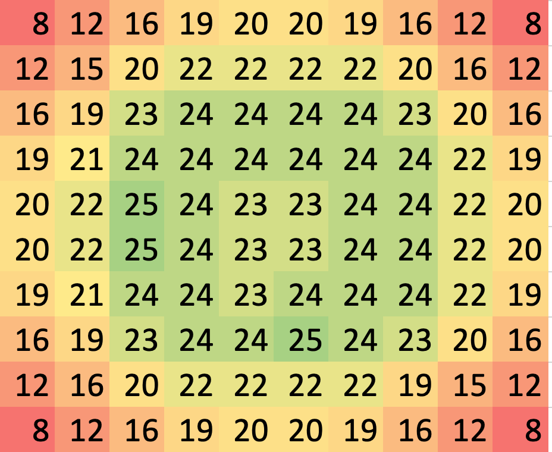
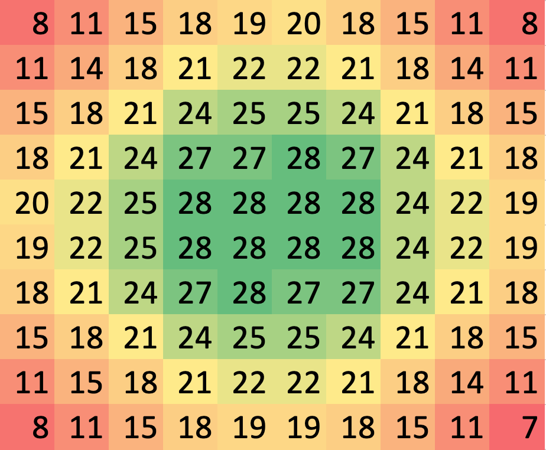
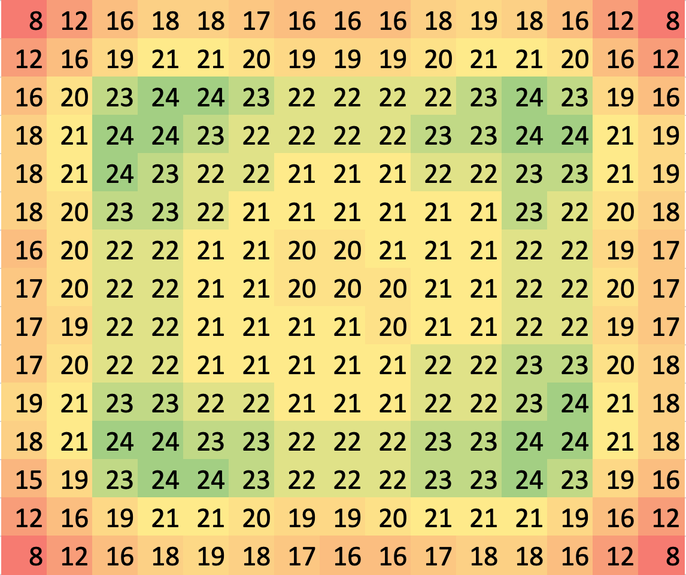

# Battleship game
Python project to build a battleship game

## The specifications of the battleship game:

The challenge is to program a simple version of the game Battleships (video). Create an application to allow a single human player to play a one-sided game of Battleships against ships placed by the computer.

The program should create a 10x10 grid, and place several ships on the grid at random with the following sizes:

1x Battleship (5 squares)

2x Destroyers (4 squares)

The player enters or selects coordinates of the form “A5”, where “A” is the column and “5” is the row, to specify a square to target. Shots result in hits, misses or sinks. The game ends when all ships are sunk.

You can write a console application or UI to complete the task.

## Ship placement algorithm

Two algorithms for ship placement were tested. A single direction and a multiple direction algorithm.
The battleship game uses the multiple direction algorithm because it distributes the ships more evenly on a 10x10 grid (see heat maps below)

(The single direction algorithm is still available for testing)

Both algorithms place ships similarly with several common steps. The difference between them comes from how many directions they attempt to turn the ship before selecting a new position to use as a pivot. As the names suggest, the single direction algorithm only attempts to fit the ship in one direction before selecting a new pivot position, the multiple direction algorithm attempts to fit the ship in all four directions before selecting a new pivot position

### Algorithm break down:

Until the ship has been placed on the grid loop through the following steps:

1. Select random squares on the grid until an unoccupied one is found
2. Select a random direction from that square
    a) Check that the ship fits in the grid in that direction
    b) Check that the proposed ship placement doesn't overlap with another ship
3. If ship fits in the grid and doesn't overlap -> place the ship
4. Otherwise:
    * For the single direction algorithm:
        Go back to step 1 and select a new random square
        
    * For the multiple direction algorithm:
        Go back to step 2 and try another direction
        If all 4 directions have been tried without being able to place the ship,
        go back to step 1 and select a new random square

### Advantages and Disadvantages

Algorithm | Multiple direction | Single direction
------------ | -------------|------------
Advantages | More even ship distribution across the grid | Corner artefacts of the multiple direction algorithm aren't present
Disadvantages | Has corner artefacts where ships more frequently occupy squares slightly away from the edges and corners - more easily seen on the 15 x 15 heatmap below | Places ships in the corner areas slightly less frequently

## Heatmaps of ship placement

The heatmaps show the relative distribution of ships after placing the 3 ships in the grid 100000 times. The numbers in the grids have been rounded to make the relative distribution clearer

### 10 x 10 Grid heatmap of ship distributions

#### The multiple direction algorithm

#### The single direction algorithm 

### 15 x 15 Grid heatmap of ship distributions

#### The multiple direction algorithm

#### The single direction algorithm 

